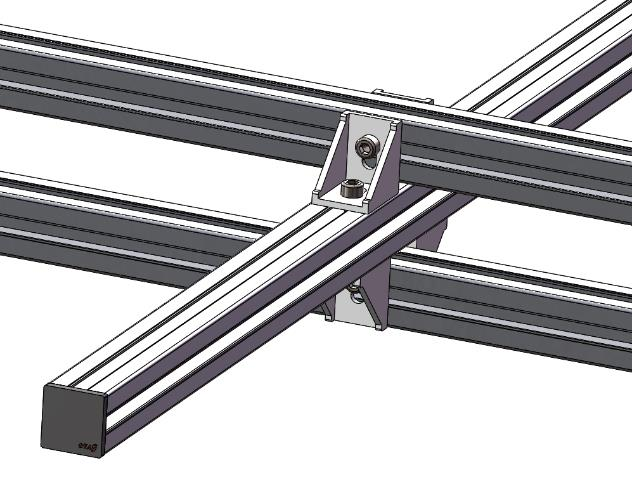
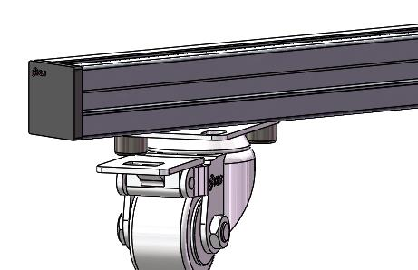
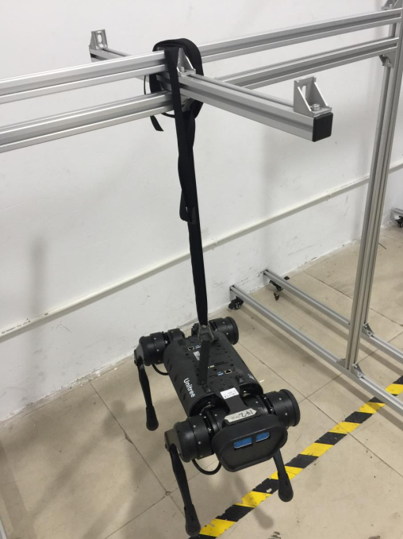
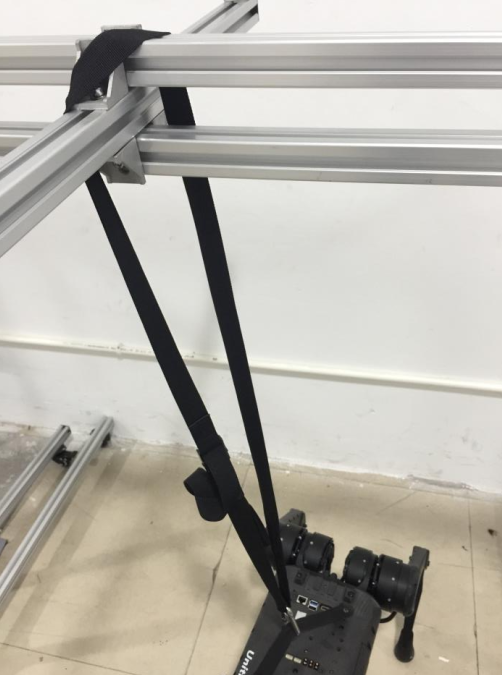

======================
Protective Frame Setup
======================

The following guide walks through the setup of the Go1's protective frame.

.. attention::

    When not using the protective frame, do NOT use the emergency stop remote.
    This may cause the robot to be seriously damaged.
    Damage caused by this is not covered under Unitree's warranty

Assembly Reference
==================

.. container:: no-table

    .. list-table::
        :align: center
        :widths: 40 40

        * - .. image:: images/frame.png
                :align: center

          - .. list-table::
                :align: center
                :header-rows: 1

                * - Frame Component
                  - Size
                * - [1] Bottom Support Rod
                  - 1.2m
                * - [2] Side Support Rod
                  - 1.2m
                * - [3] Top Support Rod
                  - 1.2m
                * - [4] Top Hanging Rod
                  - 0.7m

Top Hanging Rod / Top Support Rod Mounting
------------------------------------------

Wheel / Bottom Support Rod Mounting
-----------------------------------

Final Result
------------

Assembly Steps
==============

1.  Assemble the bracket screws, washers, and nuts together.

.. container:: no-table

    .. list-table::
        :align: center

        * - .. image:: images/bracket.png
                :align: center
                :width: 450

          - .. image:: images/bracket_assembled.png
                :align: center
                :width: 300

2.  Install wheels to Bottom Support Rod [1].
    Secure the two holes on the wheel diagonals.

3.  Install Left and Right Side Support Rods [2].
    Fix the side support bar [2] to the Bottom Support Rod [1].

4.  Install Top Support Rod [3] to the Top Hanging Rod [4].
    Connect the brackets on both sides to the Top Support Rod [3], leaving the screws loose.
    After they are connected, tighten the screws.

5.  Install the tether.

