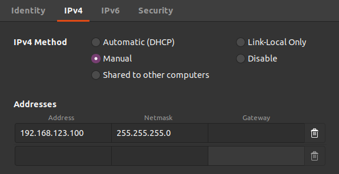

=============
Network Setup
=============

.. contents::
    :local:

Remote PC Network Setup
=======================

1.  Connect to the robot's network via a wired connection or its wireless access point.

    *   The wireless access point's SSID will be something like ``Unitree_GoXXXXXXX`` and its password is ``00000000`` (eight zeros).

2.  Configure your connection to be on the ``192.168.123.***`` network segment.
    ``***`` can be anything as long as it does not conflict with anything else on the network segment.
    Set the netmask to ``255.255.255.0``.

SSH
===

Wired Connection
----------------

To SSH into the robot on a wired connection:

.. code-block:: console

    $ ssh pi@192.168.12.1
    # password: 123

Once SSH'ed into the RPi, can access other onboard computers via the internal network switch.
For example, to SSH into the Head Nano:

.. code-block:: console

    $ ssh unitree@192.168.123.13
    # password: 123

All Nanos share the same username of ``unitree`` and password of ``123``.
See the :ref:`Go1 EDU Architecture diagram <label-go1-edu-architecture>` for a full list of IP addresses.

Wireless Connection
-------------------

The network port on the back of the Go1 EDU connects directly to its internal switch.
Because of that, any onboard controller can be directly SSH'ed into.
For example, to SSH into the Bottom Nano:

.. code-block:: console

    $ ssh unitree@192.168.123.15
    # password: 123

All Nanos share the same username of ``unitree`` and password of ``123``.
See the :ref:`Go1 EDU Architecture diagram <label-go1-edu-architecture>` for a full list of IP addresses.

Remote Development
==================

VSCode Remote Development
-------------------------

1.  At Trossen Robotics, we use Microsoft's VSCode and its Remote - SSH extension (also developed
    by Microsoft) for simple remote development.

    a.  `Install VSCode`_ for Ubuntu.

    b.  Open VSCode, Press :kbd:`Ctrl` + :kbd:`P` to launch the Quick Open Menu, and run the following command.

    .. code::

        ext install ms-vscode-remote.remote-ssh

.. _`Install VSCode`: https://code.visualstudio.com/download

2.  In VSCode, press **F1** and run the ``Remote-SSH: Open SSH Host...`` command and select the ``Add New SSH Host`` option.
    Enter the same ``username@ip`` combination you used when opening the SSH connection between your remote computer and the Go1 like ``ssh pi@192.168.12.1`` or ``ssh unitree@192.168.123.15``.
    If prompted, enter the password ``123``.

3.  Once connected, use **File > Open Folder**, and select the directory you wish to operate in, i.e. your ROS workspace if using the ROS Interface.

4.  Your instance of VSCode is now attached to the Go1's Raspberry Pi computer and is open to your development workspace.

5.  You can open terminals in VSCode by pressing :kbd:`Ctrl` + :kbd:`Shift` + :kbd:`\`` or by using
    **Terminal > New Terminal**.
