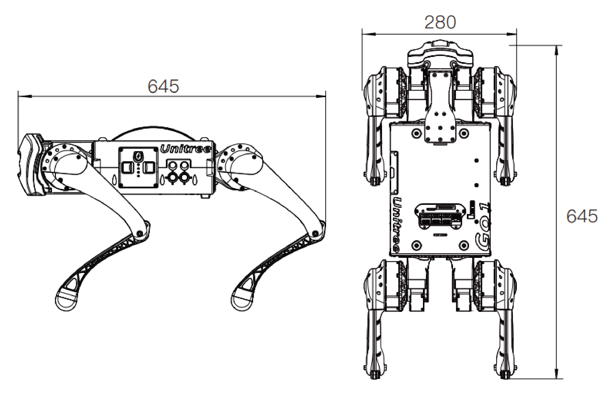

==============
Specifications
==============

.. contents::
    :local:

Specifications Overview
=======================

Back Panel
----------

.. container:: no-table

    .. list-table::
        :align: center

        * - .. image:: specifications/images/back_panel.png
          - 1.  Nano 1 USB
            2.  Nano 1 HDMI
            3.  Nano 2 USB
            4.  Nano 2 HDMI
            5.  ARM USB
            6.  ARM HDMI
            7.  Gigabit Ethernet Port
            8.  SIM Card Slot
            9.  Integrated Interface
            10. Power Supply Port 24V 30A
            11. Coprocessor Interface (Type-C)
            12. Main Processor Interface (Type-C)

Major Dimensions
================

