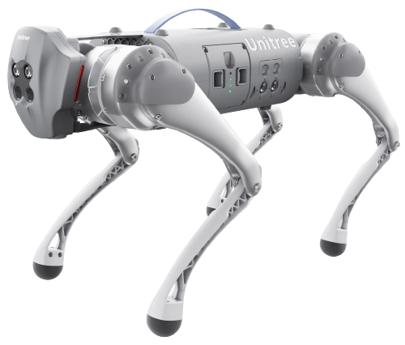

===========
Unitree Go1
===========

What's Here
===========

*   :doc:`getting_started` - These guides will walk you through the setup process for your Go1.
*   :doc:`operation` - These guides will details concepts related to the operation of the Go1.
*   :doc:`specifications` - Contains specification information for the Go1 and related hardware.

Table of Contents:
==================

.. toctree::
    :maxdepth: 2
    :titlesonly:

    getting_started.rst
    operation.rst
    specifications.rst
